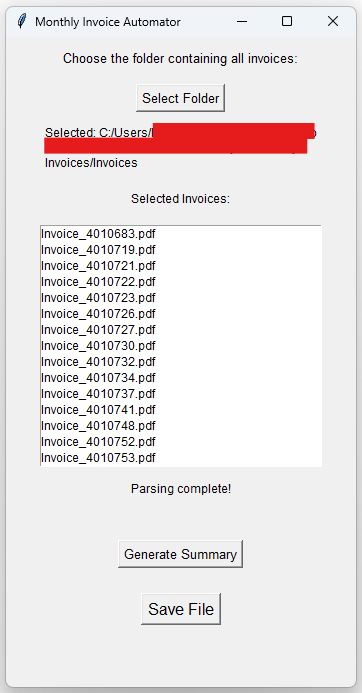

# Monthly Invoice Summary Automator

## Overview

This tool serves to automate the generation of the monthly invoices summary file for a specific external contractor. Traditionally, individual invoices have been manually translated into a singular CSV file summarizing the overall monthly costs. This method is prone to errors, duplicated or missing entries, and typos. This tool aims to simplify the task so no or minimal manual processing is needed.



## Requirements/Notes

#### What is needed/used:

- A Windows Machine
- A single folder containing all individual invoices
- All invoices following the same format

## How It Works

- The tool allows you to select a folder
- Then for every invoice file within the directory, it parses the document into a single text file
- It then scans the each text block for each invoice with simple RegEx looking for needed columns
- Then it generates a CSV file based on the categories identified
- Finally it calculates the total amount accoss all invoices using an inline Excel formula

### Tools/Libraries Needed

- Python, TKinter, Fitz, PyInstaller

To build exe, run:

```
pyinstaller --onefile --noconsole app.py
```
